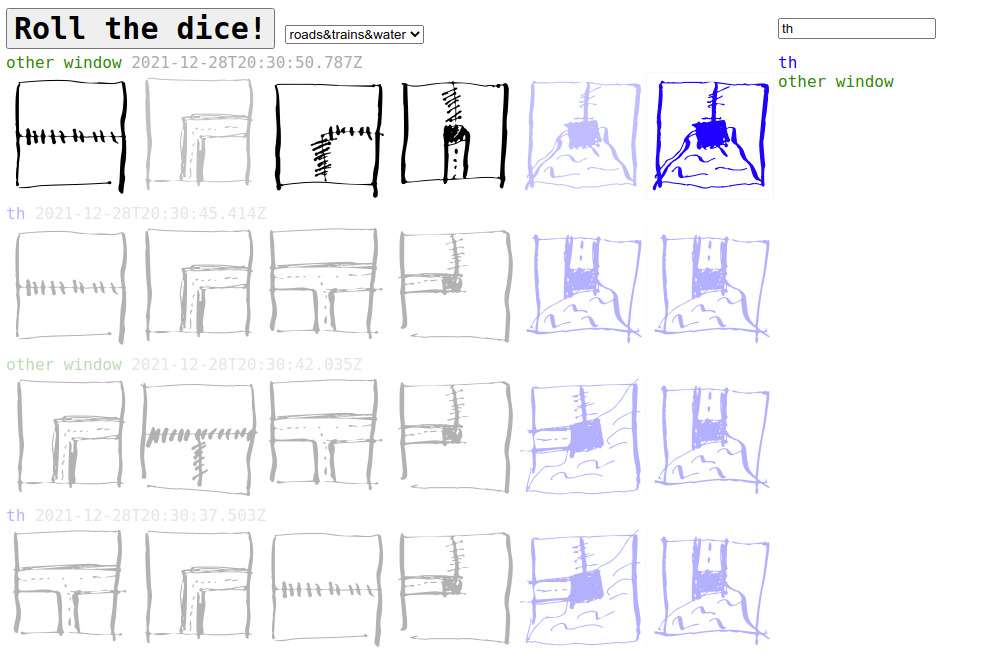

# multiparty cryptographic dice rolling server


With diceroll.games you can play dice games with untrustworhy
friends using cryptographic commitments and end-to-end encrypted
communications through an untrusted server.  As long as there is
one honest player, the other players can not collude to influence
the outcome of the die roll.

The site is heavily inspired by https://secret.cards/ and draws
from https://socket.io/get-started/chat for the communication
API.

## Playing games


Send the full URL including the `#abcd-xyzw...` portion to the
other players.  Set your nickname by clicking on the blue
highlighted player, hover over the other players to get their
verification codes. Select the type of dice to use.
Hit `Roll the dice!` and hope for the best!


## Deployment


Currently running on a home server with an nginx front end
to do SSL termination for https://diceroll.games/

Since it uses the `crypto` API in the webbrowser, it must
be loaded from `localhost` or over `https`.

## Adding dice


Check out `docs/dice.json` to see how to add new dice or sets.

## Debugging Setup


After checkout:

```
npm install
```

Then:

```
PORT=9999 npm start
```

And go to http://localhost:9999/ to load the dice rolling page


## Security analysis


Please contribute if you can! Is the DH implementation ok?
Is AES-GCM the right approach? Feel free to poke at it!
